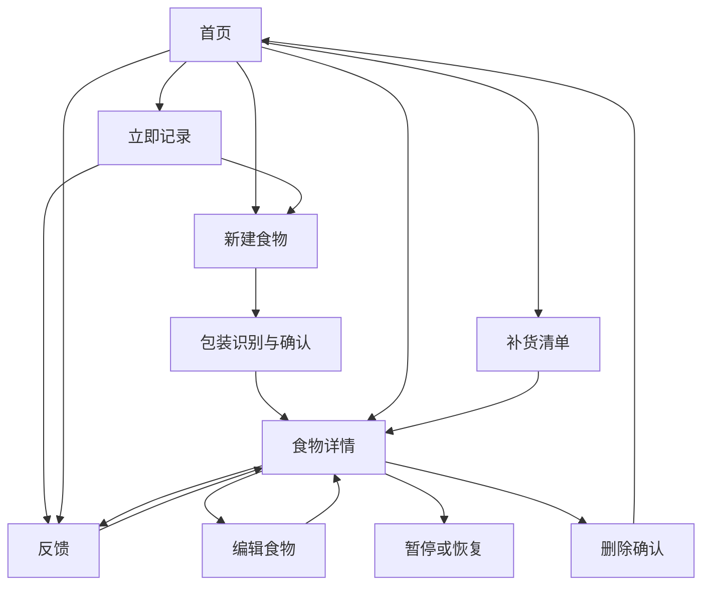
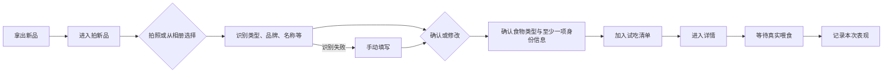
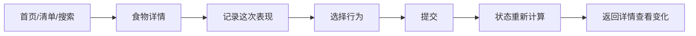
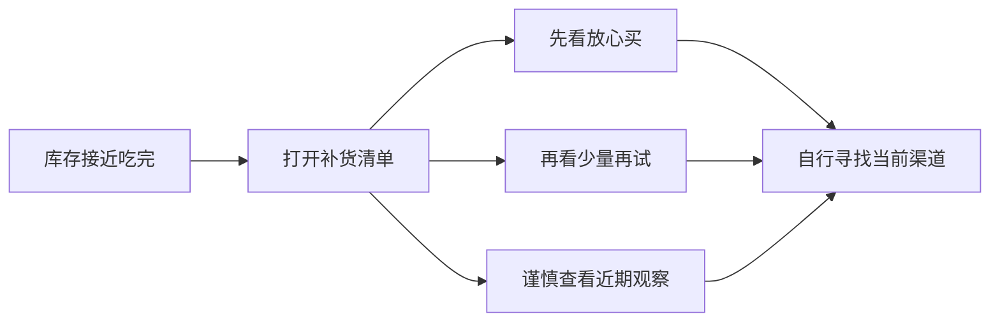
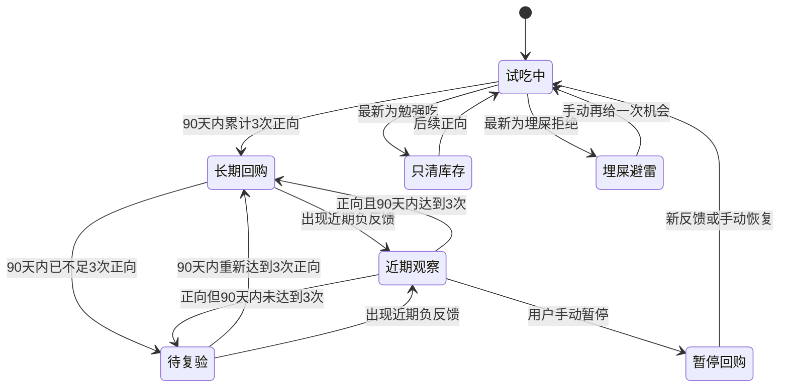

# 「猫吃了吗」交互架构

> 版本：v0.3 可用原型稿  
> 日期：2026-07-28  
> 范围：H5 / PWA P0–P1 目标架构

## 1. 交互目标

产品交互不追求“记录得全面”，而追求“在真实喂食场景中愿意继续使用”。

### 设计原则

1. **首次稍多、后续极少**  
   首次通过照片建立身份；再次记录只选择行为。
2. **行为比克重更重要**  
   湿粮和加餐难以精确称量，猫的主动性更接近用户真实判断。
3. **历史不覆盖，结论可变化**  
   以前喜欢和现在不喜欢可以同时成立。
4. **系统给建议，用户保留决定权**  
   系统可提示暂停，但不自动永久淘汰。
5. **补货判断与购买渠道分离**  
   产品回答“买什么”，不回答“去哪里买”。
6. **减少仪式感**  
   不要求每日打卡，不制造连续记录压力。
7. **先识别，再确认**  
   包装识别只负责减少输入，不替用户做不可修改的判断。
8. **以 390×844 为基准，自适应而非等比缩放**  
   设计稿按 1 倍的 390×844 px 制作；实现时保持信息层级和触控尺寸，根据设备宽度、可用高度、安全区和横竖屏调整留白、信息条数与组件密度。
9. **白灰为主，弥散只提供空气感**  
   全局画布使用 `#FAFAFA`；仅保留少量低饱和蓝、紫、粉、薄荷色弥散。首页、立即记录、建档、反馈、详情和补货清单共用同一套浅色弥散背景；承载内容的普通组件使用半透明白、细描边和局部磨砂，不使用外投影。投影只保留给猫咪头像、模态弹层和系统提示等确实脱离页面层级的元素。
10. **颜色表达含义，不承担装饰任务**  
    品牌绿 `#34C759` 只用于正向状态、已选中项和提交反馈；系统蓝 `#007AFF` 用于查看、编辑、拍照等普通操作；警告、观察和避雷分别使用低饱和黄、灰和红，不依赖同一种强调色。
11. **导航只负责到达，动作留在页面内**  
    底部三个入口都对应稳定页面。当前项用品牌绿文字、线描图标和浅绿底强调，不再使用悬浮荧光圆形按钮。内容区不低于 48px，并叠加 `safe-area-inset-bottom` 适配 Home Bar。
12. **统一 24px 线描图标**  
    通用功能使用 DDMC 的 1.5px 线描体系；猫猫头仅作为品牌标记和图片缺失兜底，不混用 3D、粗实心和手绘风格图标。

### 屏幕适配规则

- 390×844 为默认视觉验收尺寸；
- 窄屏优先压缩水平留白和辅助文字，不缩小 44 px 触控区域；
- 矮屏减少最近记录展示条数并压缩卡片纵向间距，保证“拍新品 / 记已有食物”可直接触达；
- 最近记录最多展示 5 张横向卡片；默认视窗露出 2 张完整卡片和约 0.3 张下一张卡片，以提示仍可横滑；卡片按“图片、品牌与名称、类型与构成、食用时间、反馈标签”的顺序组织；
- 横滑到最近记录末端后继续拉动可进入全部食物页，同时保留可点击的“查看全部”入口，避免依赖单一手势；
- 高屏逐步增加最近记录条数，不拉伸卡片；
- 横屏隐藏次要概览，优先保留立即记录；
- 刘海、底部手势区和移动浏览器地址栏使用安全区与动态视口单位适配；
- 平板和桌面端使用居中的手机内容画布，最大宽度 480 px，避免内容无意义横向拉长。

## 2. 信息架构

```text
猫吃了吗
├── 首页
│   ├── 立即记录
│   │   ├── 拍一款新品
│   │   └── 记录已有食物
│   ├── 最近记录
│   └── 当前补货判断
├── 立即记录
│   ├── 拍一款新品
│   ├── 记录已有食物
│   └── 最近吃过
├── 新建 / 编辑食物
│   ├── 包装照片
│   ├── 包装识别结果
│   ├── 食物类型
│   ├── 基础线索
│   └── 保存
├── 食物详情
│   ├── 食物身份
│   ├── 当前状态
│   ├── 回购进度
│   ├── 记录反馈
│   ├── 历史反馈
│   └── 编辑 / 再给机会 / 暂停 / 删除
├── 反馈
│   ├── 五种行为结果
│   ├── 勉强吃补充
│   ├── 备注
│   └── 提交
└── 补货清单
    ├── 当前猫咪
    │   ├── 猫咪头像
    │   └── 年龄
    ├── 搜索
    ├── 状态 Tab
    │   ├── 放心买
    │   ├── 少量再试
    │   ├── 待复验
    │   ├── 近期观察
    │   ├── 不主动补货
    │   └── 埋屎避雷
    └── Tab 内食物类型胶囊
        ├── 主食罐头
        ├── 零食罐头
        ├── 冻干
        ├── 猫条
        ├── 猫粮
        └── 其他
```

全局页面内容左右安全边距固定为 16px。补货清单先通过状态 Tab 限定判断阶段，再显示该 Tab 中真实存在的食物类型胶囊；默认不选类型即显示全部。

## 3. 全局导航

底部保留三个入口：

| 入口 | 角色 | 原因 |
|---|---|---|
| 首页 | 今日入口 | 默认起点，首屏仍可直接开始记录，并看到最近记录和补货摘要 |
| 立即记录 | 记录目的地 | 进入独立页面，再选择“拍新品”或“记录已有食物” |
| 补货清单 | 购买决策 | 独立于日常记录 |

详情、反馈和新建属于任务页面，不显示底部导航，避免任务中途跳出。

当前所有食物和反馈默认属于同一只猫。补货清单顶部使用浅色彩色弥散资料区展示大头像、可编辑年龄与档案统计；下方补货内容使用大圆角半透明浅色面板承接。首版不出现猫选择器或切换入口。

## 4. 页面关系



## 5. 核心任务流

### 5.1 新品首次建档



关键点：

- 不强迫用户在开罐前查全商品资料；
- 照片既是识别凭证，也是包装识别输入；
- 自动识别只预填字段，必须允许用户确认和修改；
- 识别失败不能阻塞建档；
- 建档与反馈可以分时完成；
- 保存后进入详情，让用户知道这款已经被记住。

### 5.2 同款再次反馈



关键点：

- 不重复拍照；
- 不重复填写产品信息；
- 反馈页需要持续显示正在评价哪一款；
- 提交后必须让用户感知结论是否变化。

### 5.3 补货决策



关键点：

- 补货清单默认不是完整产品库，而是决策分组；
- 放心买和少量再试应最靠前；
- 避雷内容需要保留，但不应占据首屏；
- 不绑定历史链接，避免失效和价格误导。

### 5.4 偏好变化



## 6. 页面职责

### 6.1 首页

#### 唯一问题

“我现在要记录新品，还是记录吃过的食物？”

#### 当前包含

- 立即记录主模块；
- 拍新品；
- 记录已有食物；
- 最近记录横向卡片；
- 补货摘要。

#### 主要矛盾

首页首要任务已确定为“立即记录”。品牌型 Hero 应缩为紧凑页头，不能占用主动作所需的首屏空间。状态总览和补货判断保留，但不与立即记录争夺第一视觉层级。

#### 建议的内容优先级

1. 紧凑任务说明；
2. 最近记录；
3. 补货判断摘要；
4. 首屏中下方的拍新品 / 记录已有食物；
5. 品牌性装饰。

### 6.2 立即记录页

#### 唯一问题

“这次是在尝新，还是继续记录已有食物？”

#### 交互要求

- 底部“立即记录”进入本页，刷新后仍停留在本页；
- 新品与已有食物是两个清楚分离的入口，不使用弹出菜单代替页面；
- 最近吃过的最多 5 款食物放在入口下方，点击直接进入反馈；
- 食物为空时明确提示先拍新品；
- 页面保留底部导航，中心项只使用标准线描选中态，不悬浮、不放大。

### 6.3 新建页

#### 唯一问题

“怎样用最少信息记住这是哪一款？”

#### 交互要求

- 首屏只强调包装照片；
- 拍照完成后在原流程内展示识别进度和结果，不另开复杂页面；
- 识别结果以“建议填入”呈现，不能伪装成绝对正确；
- 用户确认食物类型后再保存；
- 基础信息应允许跳过；
- 字段按识别价值排序，而不是商品数据库排序；
- 避免让用户误以为必须填写完整；
- 编辑态复用同一页面，但标题与按钮文案应明确变化。

### 6.4 反馈页

#### 唯一问题

“这次最接近哪种行为？”

#### 交互要求

- 五个选项必须一次扫完；
- 文案同时提供行为名称和判断解释；
- 强烈结果与普通结果需要有视觉差异，但不能诱导选择；
- 选中后立即显示明确状态；
- 提交按钮保持在容易触达的位置；
- 备注和辅助条件不能抢占主流程。

### 6.5 详情页

#### 唯一问题

“这款现在是什么结论，为什么？”

#### 信息顺序

1. 食物身份；
2. 当前结论；
3. 近 90 天形成结论的进度或原因；
4. 记录新反馈；
5. 历史变化；
6. 再给机会、编辑、暂停和删除。

详情页应是解释页，不应把大部分首屏空间只用于默认罐头图标。真实照片存在时可以保留大图；没有照片时默认图标应缩小，让状态解释上移。

当状态为“埋屎避雷”时，详情页提供次级动作“再给一次机会”。操作后原记录不删除，页面明确提示“已回到试吃中，下次反馈会重新判断”。

### 6.6 补货清单

#### 唯一问题

“这次应该优先买哪些？”

#### 交互要求

- 顶部先展示一次大尺寸当前猫咪头像和年龄，并允许从相册替换头像，不在每个食物卡重复猫猫头；
- 浅色彩色弥散资料区与半透明补货面板上下分层，补货面板顶部使用明显大圆角和局部磨砂；
- 按决策强度分组，不按品牌或品类分组；
- 数量只是辅助，不能压过分组含义；
- 搜索服务于快速找同款；
- 单卡优先显示包装、品牌、名称和当前状态；
- 已有照片时照片优先；主食罐头和零食罐头缺图时使用罐头线描图标，其他类型使用通用包装图标；
- 不主动补货与避雷可以折叠或下沉。

## 7. 关键组件

| 组件 | 用途 | 必须包含 |
|---|---|---|
| 食物卡片 | 列表识别 | 照片/默认图、品牌、名称、食物类型、口味、状态 |
| 状态标签 | 快速判断 | 当前状态短文案 |
| 反馈选项 | 一次行为选择 | 图标、行为名称、解释、选中态 |
| 回购进度 | 解释三次规则 | 近 90 天正向次数/3 |
| 历史项 | 展示变化 | 行为、辅助条件、备注、日期 |
| 分组标题 | 解释补货建议 | 分组名、说明、数量 |
| 识别确认区 | 降低建档输入 | 识别状态、建议字段、修改入口、失败回退 |

## 8. 状态与反馈

### 加载

当前本地读取很快，可暂不增加骨架屏；接入云端后再补充。

### 空状态

空状态必须告诉用户下一步能做什么，而不是只说“暂无数据”。

### 成功

- 建档成功：告诉用户已经加入试吃；
- 反馈成功：告诉用户已经记住；
- 状态变化：明确说明进入长期回购、待复验、观察或避雷；
- 手动再试：告诉用户历史未删除，下次反馈会重新判断。

### 错误

- 找不到食物：提示后返回；
- 未选反馈：按钮禁用并在主动提交时提示；
- 拍照取消：不提示错误；
- 保存失败：保留输入，不应清空表单。

### 危险操作

删除和暂停都需要明确后果；删除必须二次确认。

## 9. 交互文案原则

- 用用户会说的话，不使用营养学或数据分析术语；
- 描述猫的行为，不评价猫“乖不乖”；
- 结论使用建议语气，不伪装成科学诊断；
- 不使用“猜你喜欢”这类公共推荐表达；
- 用“主子投过的票”保留产品个性，但关键操作仍应直白。

## 10. 视觉调整检查表

### 首页

- 品牌标记是否保持紧凑，不抢任务标题？
- 两个记录入口是否稳定停留在单手拇指可触达区？
- 用户第一眼能否在“拍新品”和“记录已有食物”之间选择？
- 最近记录是否最多展示 5 款且可横滑？
- 补货摘要是否保持次要层级？

### 底部导航

- 三个入口是否都能到达稳定页面，而不是直接触发动作？
- 图标是否统一为 24px、1.5px 线描体系？
- 当前项是否只用品牌绿和浅绿底强调，没有悬浮大圆按钮？
- 内容区是否至少 48px，并叠加设备底部安全区？

### 新建页

- 拍照区域是否过大，导致基础字段看起来很重？
- 包装识别中、识别成功和识别失败三种状态是否清楚？
- 识别结果是否看起来可以修改？
- 食物类型是否能一次点选完成？
- 用户能否明确知道字段可以不填？
- “打开相机”和“从相册选择”是否需要分开？

### 反馈页

- 五种结果是否能在一屏内理解？
- 图标是否影响严肃程度或诱导选择？
- 强烈拒绝是否需要更克制的颜色，而不是过度警告？

### 详情页

- 无真实照片时，默认罐头图是否占据过多空间？
- 当前状态是否足够靠前？
- 反馈历史是否能清楚表现“以前喜欢、现在不喜欢”？

### 补货清单

- 是否需要默认只展开“放心买”“少量再试”和“待复验”？
- 卡片是以图片识别为主，还是以名称为主？
- 搜索是否比分类更常用？

## 11. 建议下一轮先调整的三个问题

1. **设计包装识别确认态**  
   覆盖识别中、成功、疑似同款和失败回退，保持建档流程连续。
2. **验证记录页是否提升二次反馈**  
   观察用户更常从首页动作、底部记录页还是最近食物进入反馈，再决定是否合并入口。
3. **补齐本地数据备份**  
   在多人试用前提供最小导出能力，降低清缓存和换设备导致的数据丢失风险。
